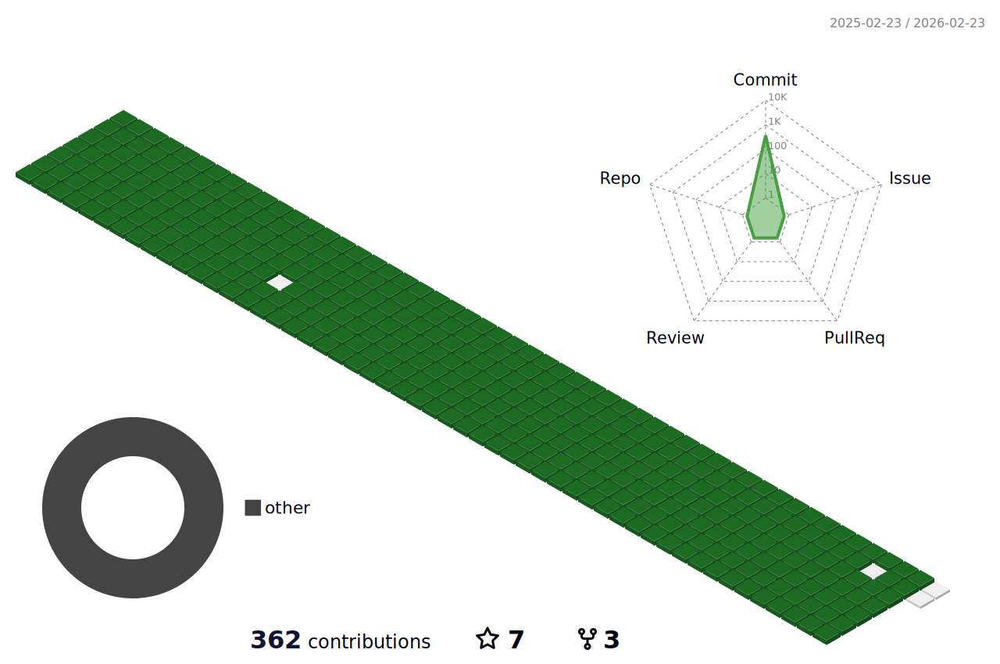

### Hi there 👋

Hi! I am Jaehun from South Korea.  
Recently, I've been interested in DevOps.  
I hope that I'll be a conscientious and skillful developer.

  

### Things I've used more than once

  
  
  
  
  
  
  
  
  
  
  
  
  
  
  
  
  

## Skill

- Pycharm professional에서 sftp방식으로 서버에 접속하는 환경구축 경험
- AWS EC2를 활용해 ubuntu server를 띄우고 putty와 터미널을 통해 접속한 경험
- Git CLI,GUI 사용경험(git bash/cmder/github desktop/sourcetree)
- Django기반 firebaseUI Authentication Demo 적용 경험
- Public Cloud(AWS)의 다양한 서비스를 체험해본 경험(RDS,VPC,ECS,ECR)
- Clever Programmer님의 Netflix Clone coding 후 firebase deploy경험
- github page를 활용한 static website clone coding(Johns Hopkins Web Course)
- Jira/Slack/Notion/Google Teams/Google Meet을 활용한 협업 경험

## Experience

- 웹 (인턴) 2021.12.27~ 2022.2.18

⇒ 독일에서 근무하시는 Senior Developer님을 보조하는 업무

⇒ 현장에서 DB column과 불일치하게 받은 survey data를 DB Schema에 조정 논의 및 인트라에 반영되도록 쿼리문 작성

⇒ Django Firebase Authentication Demo 적용 및 js 난독화 obfuscator 실습

## Education
- fastcampus devops강좌 66일 1일1블로깅 Challenge : 2022/4/18~2022/6/22 - 성공
- 커넥트재단 부스트코스 CS50(2019) - '모두를 위한 컴퓨터과학' 강좌 수료
- Cloud/App 개발 Study 동문멘토링(AWS):  2022/2~ 진행중
- 인재개발원 동문멘토링(Microsoft) : 2021/12/27 ~ 2022/1/21(2회)
- SW중심사업단의 방학 Bootcamp에 다수 참여(C:4주,python:3주,Database:3주,React:1주,SwiftUI:1주)
- SW중심해커톤참여 : 매력적인 프로젝트는 어떤 것인지, 어떤면에서 공격받을 수 있는지 날카로운 피드백들을 많이 받으며 깨달았고 개발을 어떤식으로 해야할지 잘 몰랐는데 Notion,Slack 등의 협업툴 사용 방법을 알게됨. 써본것**≠**아는것이라는 것을 깨닫고 개발적인 성장이 아주 많이 필요하다는 반성을 하고 공부방향을 잡게됨.
- 한국SW테스팅협회 테스팅교육: 2021/2/22 ~ 2021/2/24
- 여러 기업들에서 주관하는 웨비나에 종종 참여 등..

## Projects

### Naver Open API를 활용한 바코드 인식 최저가 상품검색 안드로이드 App 제작

- 개발 언어/라이브러리 : zxing lib(바코드인식) , android java
- github : https://github.com/2021-SW-6/barcode-app-workspace
- notion : [https://fragrant-magic-b1b.notion.site/f339ccfd7bbb4c8eb1d94a67f018e784?v=0d0c81f13fbb4bac8a2a71bec06d1131](https://www.notion.so/f339ccfd7bbb4c8eb1d94a67f018e784)
- 내용: (소프트웨어공학 수업에서 개발명세서 작성 후 랜덤으로 섞고 받은 명세서를 구현해보기)

google의 zxing library opensource를 사용해 barcode number를 추출하고 해당 내용을 httprequest로 코리안넷페이지로 요청을 하여 jsoup으로 데이터를 json으로 변환하고, 상품이름을 추출한뒤 naver open api로 다시 httprequest를 보내 상품구매페이지로 연결시키는 프로젝트

- 기여한 부분:

Naver open API관리, 프로젝트 흐름 설계 및 notion 문서 관리, barcode 필요한 기능 customize, 팀원에게 발생한 문제에 대해 해결책으로 보이는 reference 검색하여 공유, ovenapp prototype, Readme 관리, git command 공유 및 convention제작, Jira Issue Tracking 적용    

### SIML과 Unity3d 기반 google TTS API를 활용한 대학교 Chatbot 제작

- 개발환경: Unity3D, Syn Bot Studio,Unity Teams
- 내용: google TTS API를 통해 text to speech 기능을 사용하였고 Unity Store의 Asset을 구매해 애니메이션 동물이 음성으로 반응하도록 챗봇제작
- 기여한부분:

Unity reference 공유, Unity Teams 적용, 회의주도, syn bot studio에 등록하는 특정 request
에 대한 response도출하는 알고리즘 개발, Error Issue 같이 검색하여 해결하며 진행    

### 문구관리 DB프로젝트

- 개발환경: apache tomcat, JSP, MYSQL, Eclipse
- github: https://github.com/nojahoon/2020_Database_project
- 내용: DB수업 프로젝트로 어떠한 프레임워크의 사용도 절대적으로 금지된채로 low level에 가깝게 문구관리 DB 웹구현하기
- 기본 구현조건 : 회원가입/출처-인물-문구 등록/수정/검색/삭제 구현
- 추가 구현내용 : public/private 문구 관리/랭킹페이지 출력    
  

### Unity3d와 Unity asset store 활용한 치매/뇌졸증 환자 회복 프로젝트

- 개발환경: Unity3D, Unity Teams, Visual Studio(C#)
- 영상: [https://drive.google.com/file/d/1UkBaJYBSqXVE6LrCcKktHh0oqt_BBfZr/view?usp=sharing](https://drive.google.com/file/d/1UkBaJYBSqXVE6LrCcKktHh0oqt_BBfZr/view?usp=sharing)
- 내용: 윈도우 프로그래밍수업 프로젝트로 기존 계획한 간단한 프로젝트를 취소하고 교수님이 더 높은 난이도로 제안해주신 프로젝트 구현한 경험

 제한시간안에 장애물을 피해서 집에서 슈퍼마켓으로 길찾기를 하고 구매 품목 체크리스트 미션부여 후 물품의 가격을 기억해 장바구니에 담고 계산금액 측정 뒤 게임결과 보여주기

- 기여한부분:

슈퍼마켓의 각 코너 Asset/체크리스트/계산/게임결과 관리

끝무렵에 형상관리 툴인 Unity Teams가 많이 버벅이고 꼬여서 파일들 받아서 종합해서 커밋관리(디자인능력자분과 같이 협업)    
  

### pygame을 활용한 파이썬 부루마블 제작

- 개발환경: Python3.7, Pycharm, pygame
- github: https://github.com/nojahoon/2019_SW_EDU_Pygame_BlueMarble
- 내용: SW중심사업단의 방학 bootcamp에서 python을 처음으로 2주배우고 1주간 프로젝트 진행해보기
- 기여한 부분:

적용Library검토, Map 구현, Rule 설계, 알림화면/게임진행 등 전체적인 로직 설계 및 필요함
수 회의, 보고서 및 ppt 작성,캐릭터 스토리 텔링,음악삽입  
  

### Study Plan
- Devops 공부하기 (Docker/K8s, Terraform,monitoring, MSA…)
- Java/Spring 공부하기 : 기회되면 Effective Java 읽어보기
- 객체지향 코드, 리팩토링 서적 읽기
- 대외활동 알아보기

=> 일부 변경된 사항있음. 7~9월 현직자분들과 node 사이드프로젝트 참여, 추석부터 SW활동병행

<!--
**nojahoon/nojahoon** is a ✨ _special_ ✨ repository because its `README.md` (this file) appears on your GitHub profile.

Here are some ideas to get you started:

- 🔭 I’m currently working on ...
- 🌱 I’m currently learning ...
- 👯 I’m looking to collaborate on ...
- 🤔 I’m looking for help with ...
- 💬 Ask me about ...
- 📫 How to reach me: ...
- 😄 Pronouns: ...
- ⚡ Fun fact: ...
-->
